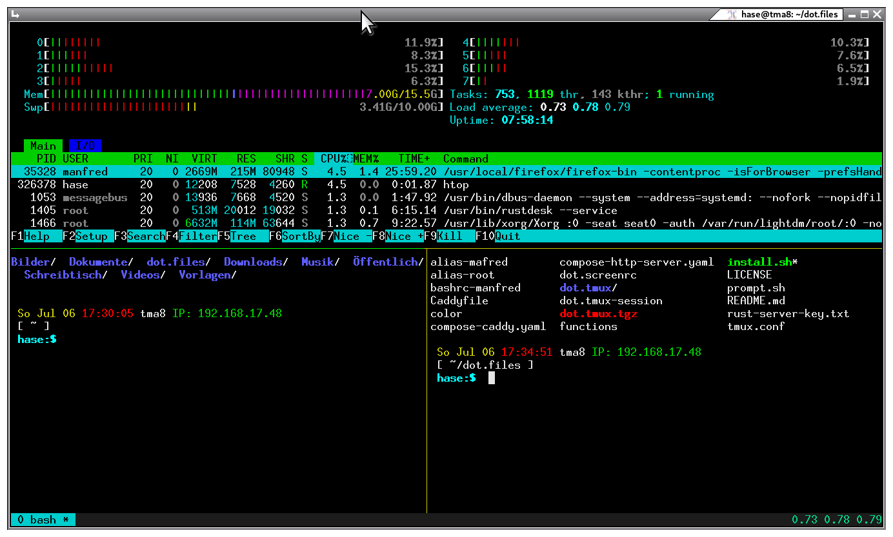

# Einrichtung der "Tmux" Umgebung inkl. Alias u. Prompt


1. Das Repository klonen
```
git clone https://github.com/mntma1/dot.files.git
```
2. Dann das `install.sh` abfeuern
```
cd dot.files && ./install.sh
```
3. Oder die Dateien von Hand kopieren
```
alias-root -> /root/.alias
function   -> /root/.function

alias             -> ~/.alias for all users
bashrc            -> ~/.bashrc for all users 
color*            -> sudo install color /usr/local/bin
functions         -> ~/.functions for all user
prompt.sh         -> Creates the prompt (Is included in bashrc-manfred)
tmux.conf         -> ~/.tmux.conf
dot.tmux.tgz      -> tar xvzf dot.tmux.tgz
dot.tmux-session  -> -/.tmux-session for all user
```
3.1 Oder das Verzeichnis von Hand kopieren
```
cp -av dot.tmux ~/.tmux
```


## Das Install Script

**./install.sh**

```
tar xvzf dot.tmux.tgz
cp -av dot.tmux ~/.tmux
cp -fv alias ~/.alias
cp -fv bashrc ~/.bashrc
cp -fv functions ~/.functions
cp -fv dot.screenrc ~/.screenrc
cp -fv tmux.conf ~/.tmux.conf
cp -fv dot.tmux-session ~/.tmux-session
#sudo cp -v functions /root/.functions
#sudo cp -v alias-root /root/.alias
#sudo cp -v dot.tmux-session /root/.tmux-sessionr
#sudo cp -v tmux.conf ~/root/.tmux.conf
#sudo install color /usr/local/bin
source ~/.bashrc
cd ~
echo
echo ....fertig
echo 
#sudo apt install tmux
#tmux
exit 0
```
