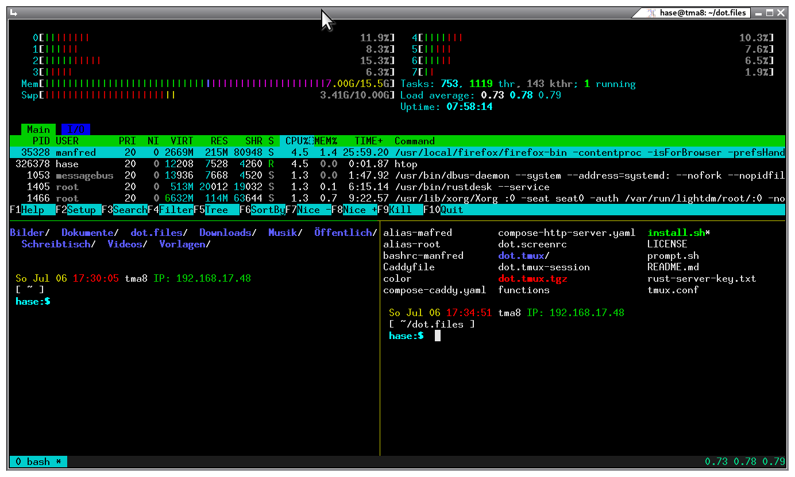

# Einrichtung der "Bash" Umgebung inkl. Tmux, Aliases und dem Prompt(PS1=)

PS1 ='\n \[\e[33m\]\d\[\e[00m\]\[\e[91m\] \t\[\e[00m\] \H\[\e[32m\] IP: ${PS1_CMD1}\[\e[00m\] \n [ \w ]\n \[\e[96;1m\]\u:\$ \[\e[0m\]';

:-)



1. Als Root oder User: Das Repository klonen
```
git clone https://github.com/mntma1/dot.files.git
```
2. Dann das `install[-root].sh` abfeuern

2.1 Als Root
```
sudo bash
cd dot.files && ./install-root.sh
```

2.2 Als User
```
[Strg]+D
cd dot.files && ./install.sh
```
3. Die .bashrc neu laden oder ein neues Terminal offnen
```
source ~/.bashrc
```
Nu isses Bunt :-)


